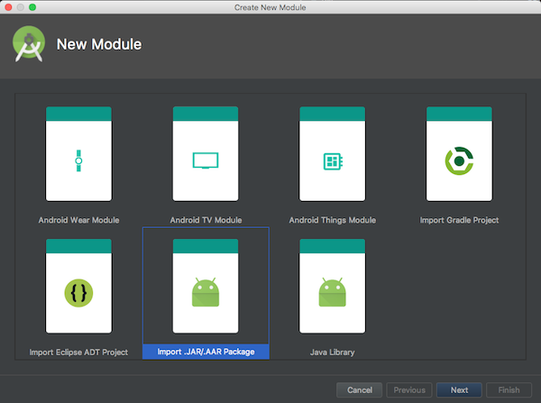

# LatipaySDK-Android-Demo

Using [Latipay](http://www.latipay.net) sdk to intergrate Alipay and Wechatpay


### 1. Download latipay.aar module and import it into your android studio project.




Add dependencies in your project's build.gradle

```
implementation 'com.squareup.okhttp3:okhttp:3.8.1'
implementation project(':latipay')
```

### 2. Setup Latipay info, [you can get apiKey here](https://merchant.latipay.co.nz/user/regist.action)

```swift

LatipayAPI.setup("apiKey", "userId", "walletId");

```

### 3. App user purchases with goods using wechat or alipay app

```java

AlipayRequest req = new AlipayRequest(this);
req.amount = "0.01";
req.merchantReference = "a reference";
req.productName = "Fossil Women's Rose Goldtone Blane Watch";
	
req.setListener(new AlipayOrderAndPaymentListener() {
    @Override
    public void onOrderCompleted(HashMap<String, String> latipayOrder, Error error) {
        //1. create a latipay order which is unpaid.
    }
    
    @Override
    public void onPaymentCompleted(String result, Error error) {
        //2. then alipay app will tell you the result of payment
    }
});
	
LatipayAPI.sendRequest(req);
```

### 4. But for Wechatpay, there is one more step. We need to request the result of payment when Wechat app finished the payment.

```java
private String wechatpayOrderId;


WechatPayRequest req = new WechatPayRequest(activity);
req.amount = "0.01";
req.merchantReference = "a reference";
req.productName = "Fossil Women's Rose Goldtone Blane Watch";

req.setListener(new WechatpayOrderListener() {
    @Override
    public void onOrderCompleted(HashMap<String, String> latipayOrder, Error error) {
        
        wechatpayOrderId = latipayOrder.get("order_id");
    }
});

LatipayAPI.sendRequest(req);
```
Load the infomation of latipay order in onResume()

```java
LatipayAPI.getPaymentStatus(wechatpayOrderId, new LatipayAPI.PaymentStatusListener() {
    @Override
    public void onOrderStatusSuccess(String result) {
    	//unpaid or paid
    }

    @Override
    public void onOrderStatusFailed(Error error) {

    }
});
```
### 5. No more steps in App

--

### 6. In your web server, please support the below api for callback when payment successful or failed
API: https://yourwebsite.com/pay_callback

Method: GET

Parameters:

```
order_id=1&...
```


