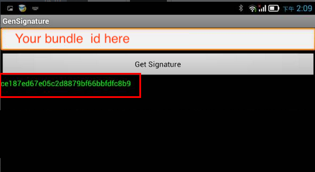

# LatipaySDK for Android app

Using [Latipay](http://www.latipay.net) sdk to intergrate Alipay and Wechat pay mobile app payment solution. Alipay or Wechat app is required.


### 1. For security reasons in android apps, Wechat pay needs extra signature of your app.

* The signature depends on keystore and app bundle id. So please setup your keystore first for your project [Sign Your App](https://developer.android.com/studio/publish/app-signing).
* Run [this apk](https://open.weixin.qq.com/zh_CN/htmledition/res/dev/download/sdk/Gen_Signature_Android.apk) in your android phone.
* Generate your the signature with bundle id.
* All is done. Please tell us your signature.



### 2. Download [latipay.aar](https://github.com/Latipay/LatipaySDK-Android-Demo/raw/master/latipay/latipay.aar?1525301264551) module and import it into your android studio project.

Android Studio: File > New > New Module


Add these two dependencies in build.gradle

```
dependencies {
  ...

  implementation 'com.tencent.mm.opensdk:wechat-sdk-android-with-mta:+'
  implementation project(':latipay')
}
```

### 3. Setup Latipay info in project, [you can get apiKey here](https://merchant.latipay.net) or [contact us](http://www.latipay.net/contact/)

```java
LatipayAPI.setup("your apiKey", "your userId", "your walletId");

```

### 4. How to use Alipay?

```java

AlipayRequest req = new AlipayRequest(this);
req.amount = "8.88";
req.merchantReference = "89439798527864287364"; //must be unique in your system
req.productName = "Fossil Women's Rose Goldtone Blane Watch"; //optional
req.callbackUrl = "https://yourwebsite.com/pay_callback";

req.setListener(new LatipayListener() {
  @Override
  public void onOrderCompleted(HashMap<String, String> latipayOrder, Error error) {
    //1. create a latipay order which is pending.
  }

  @Override
  public void onPaymentCompleted(String result, Error error) {
    //2. then alipay app will tell you the result of payment
  }
});

LatipayAPI.sendRequest(req);
```

### 5. How to use wechat pay?

```java

WechatpayRequest req = new WechatpayRequest(this);
req.amount = "8.88";
req.merchantReference = "1239127391273213132"; //must be unique in your system
req.productName = "Fossil Women's Rose Goldtone Blane Watch"; //optional
req.callbackUrl = "https://yourwebsite.com/pay_callback";

req.setListener(new LatipayListener() {
  @Override
  public void onOrderCompleted(HashMap<String, String> latipayOrder, Error error) {
    //1. create a latipay order which is pending.
  }

  @Override
  public void onPaymentCompleted(String result, Error error) {
    //2. then wechat app will tell you the result of payment
  }
});

LatipayAPI.sendRequest(req);
```

### 6. Please support the `callbackUrl` in AlipayRequest and WechatpayRequest for receiving the result of payment in your backend server.

```
POST https://yourwebsite.com/pay_callback
Content-Type: application/x-www-form-urlencoded
```

Parameters:

```json
{
  "transaction_id": "43cb917ff8a6",
  "merchant_reference": "dsi39ej430sks03",
  "amount": "120.00",
  "currency": "NZD",
  "payment_method": "alipay",
  "pay_time": "2017-07-07 10:53:50",
  "status" : "paid",
  "signature": "14d5b06a2a5a2ec509a148277ed4cbeb3c43301b239f080a3467ff0aba4070e3",
}
```

[More info about this notify api](http://doc.latipay.net/v2/latipay-hosted-online.html#Payment-Result-Asynchronous-Notification)
